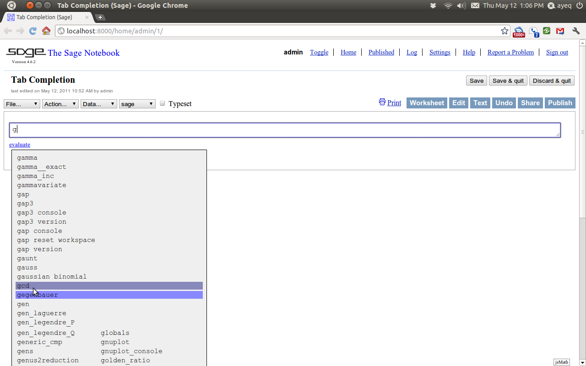
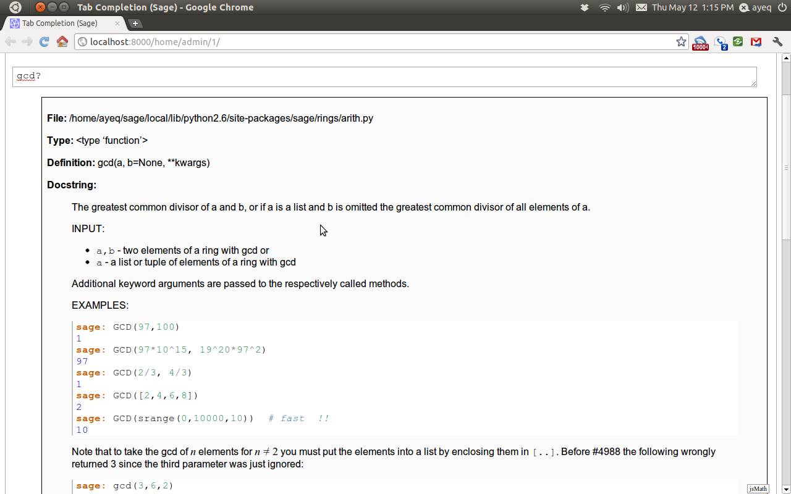

.. _about_tutorial:

***********************************
 About this tutorial
***********************************

.. _about_tutorial_introduction:

Introduction
============

.. _about_tutorial_howto:

How to use this tutorial
------------------------

This tutorial is divided into four main parts. The first we named *About this Tutorial*, and is intended to introduce the reader to the basic structure of the tutorial and how to contribute to the project if they desire.  

The section we titled *Sage as a Calculator* will get the reader up to speed with topics such as; How to do arithmetic, evaluate functions, create simple graphs, and do some basic computations like integrals and derivatives. We call this section *Sage as a calculator* because most of the topics covered are those that are commonly done with a standard graphing calculator. The target audience for this section is any motivated pre-calculus or calculus student.   

In the section *Programming in Sage* we begin to introduce the reader to some of the more *subtle* issues about how Sage works: such as how Sage handles numbers, how to define and use variables and functions; How to manipulate lists, strings, and sets; and a practical introduction to how Sage deals with the *universes* and *coercion*. 

Finally *Mathematical Structures* introduces the topics that one finds in college level curriculum: number theory, groups, rings, fields, etc. 
 
Since this is a tutorial introduction to Sage we will be using examples to demonstrate ideas and the reader is encouraged to follow along with as we progress by entering the commands into their own copy of Sage. We have tried to include exercises for practice and problems for more extensive exploration of a given topic. The reader is also encouraged to do as many of these as they can. 

While the tutorial mostly progresses in a linear fashion, material covered early is then used later, we still include at the beginning of each section a list of topics which you should understand before proceeding. This list follows the text "You should be familiar with." and by clicking one of these links you will be taken to the relevant portion of the tutorial. We have also tried to include links to further information and other on-line references, these will follow the "**See also:**" text. 

Some sections may contain numbered citations such as "[1]_." At the bottom of a section with at least one citation will be a bibliography section, with the entries correspondingly numbered.

**Bibliography**

.. [1] example citation: Alfred P. Nobody

.. _about_sage:

About Sage
----------------

Sage is a free open source mathematical software system based on the Python programming language. Originally created for research into mathematics, it has been evolving into a powerful tool for math education. Sage combines numerous other mathematical software packages using a single interface.

As an open source project, Sage invites contributions from all of its users. This tutorial is one of many sources of information for learning about Sage. See the Sage webpage for more information.

.. seealso::
   `Sage on the Web <http://www.sagemath.org>`_ 

 
.. _installing_sage:

Installing Sage
-----------------

The Sage web-site already contains detailed instructions for installing sage on all popular operating systems. So we will not duplicate that effort but rather just point the reader to the sage project's `official installation guide <http://www.sagemath.org/doc/installation/>`_
 
.. _contributing: 

Contributing to the Tutorial 
==================================

Additions to this tutorial are encouraged as are suggestions for additional topics for inclusion.

All of this website's source code can be downloaded from the project's `bitbucket <https://bitbucket.org/ayeq123/sdsu-sage-tutorial/>`_. There you will find a complete copy of the source code for generating this website. To build the site from it's source the reader will need to install the `Sphinx Documentation <http://sphinx.poco.org>`_ which is written in the `Python Programming Language <http://www.python.org>`_ We are excited to see any changes that you make so let `us <monarres@rohan.sdsu.edu>`_ know of any new material that you may add. We want for this tutorial to be as comprehensive as possible and any assistance toward this goal is welcomed.

The content of the this tutorial has be written using `reStructured Text <http://sphinx.pocoo.org/rest.html>`_ which is processed by `Sphinx <http://sphinx.pocoo.org/>`_ to produce the HTML and PDF output. Sphinx and reStructured Text are used throughout the official Sage and Python documentation and is useful to know if the reader is interested in making contributions to either of these projects. Also, selfishly perhaps, the authors felt that by using these tools our work can be integrated with the official documentation at some point. 

We have four parts to the tutorial: "How to use this tutorial" has basic instructions about using and amending the tutorial, and the others have mathematical content. "Sage as a Calculator" is intended, as the title suggests, to cover straightforward computations, and we have designed it to be fairly accessible to an entering college student, or to a bright high school student.

"Programming in Sage" eases the transition to higher level mathematics by treating topics that relate to the interface between mathematical concepts and computational issues. This chapter covers basic structures like: Lists, sets and strings; The universe for a number or variable, rational numbers versus real numbers (of specificied precision); Programming essentials like conditionals and iterative computation; File handling, data handling etc.

In "Mathematical Structures" the emphasis is on learning about specific mathematical structures, which have a Sage class associated to them.

.. seealso::
   #. `reStructured Text Primer <http://sphinx.pocoo.org/rest.html>`_

.. _credits_and_license:

Credits and License
---------------------

The content and code for this tutorial were written by Ryan Rosenbaum and David Monarres under the supervision of Mike O'Sullivan. The work was supported by San Diego State University's Presidential Leadership Fund and is licensed under the `Creative Commons Attribution-ShareAlike 3.0 <http://creativecommons.org/licenses/by-sa/3.0/>`_ License. You are free to share and to remix, but attribution should be given to the original funder and creators.

.. _tips:

Helpful Tips
-----------------

Sage has two common ways to enter commands, the *command line* and a web-based *notebook* which is similar in design an purpose to the interfaces of other computer algebra systems like *Maple*, *Mathematica* and *Matlab*. On the mailing lists these are often referred to as *The M's*.  

.. _help_tabcompletion:

`?` and Tab Completion
^^^^^^^^^^^^^^^^^^^^^^^^^^

Probably the most useful feature both in the command-line interface and the notebook is *tab completion*. For long time unix shell users this feature can e taken for granted, but for those of you whose only command line experience is with DOS this feature will seem like magic. To use tab completion, just start by typing the first couple of letters of the command that you would like to use, then hit the tab-key. Suppose that I wanted to compute  :math:`56!` and I don't remember the exact command name to do this. Well, I just type `fac` then hit the tab-key. ::

  sage: fac[TAB]
  factor     factorial  
  sage: factor

Which tells me that the only two Sage commands which begin with `fac` are :py:func:`factor` and :func:`factorial`. Note also that Sage has already changed my command from `fac` to `factor` because that is the common root of both commands. Since factorial is what I am looking for i just type the next letter `i` and hit tab again. ::

  sage: factorial   

This time no list is returned because the only command that begins with `factori` is :func:`factorial` so it just *completes* the command for me. So I can computer :math:`56!` by just completing the command by adding the `(56)`.  ::

  sage: factorial(56)
  710998587804863451854045647463724949736497978881168458687447040000000000000

Another good use of tab-completion is to use it to discover what *methods* an object has. Don't worry if you have never heard of the term object or method before, I think that will be clear what we are doing if you just follow along. What I am presenting now is assuming that you are using tab-completion on the command line, the notebook works slightly differently and we will discuss that in the next section.

Say I have the integer :math:`a = 56`. In this case the :math:`a` is our object and we can find all of the *methods* associated with integers by typing `a.` then hitting the tab-key. ::

  sage: a = 56
  sage: a.[TAB]
  a.N                            a.kronecker
  ... A long list of Commands ...
  a.divisors                     a.parent
  a.dump                         a.popcount
  a.dumps                        a.powermod
  a.exact_log                    a.powermodm_ui
  --More--

Do not be intimidated by the length of this list. Sage is a very powerful program and all this means is that it knows how to do a lot with integers. I want to draw your attention to the `--More--` at the bottom of the screen. This is telling us that the list is actually longer than what is shown. To scroll through this list a page at a time just hit any key and Sage will show you the next page.

On the second page I see something that I recognize. I understand what it means to :meth:`factor` an integer so I will use this method by entering `a.factor()` and hitting return. ::
 
  sage: a.factor()
  2^3 * 7

Now that I know how to *discover* new commands in Sage, I will sometime need to figure out *what* a new command does and *how* to use it. Sage has a built-in help system to solve this very problem. 

Lets say that I know that to take the *lowest common multiple* of two integers and I do not know which command does this. So starting from a command prompt I just type `l` and then hit the tab-key.  ::

  sage: l
  laguerre                    list_plot3d
  lambda                      lk
  laplace                     ll
  latex                       ln
  lattice_polytope            lngamma
  lazy_attribute              load
  lazy_import                 load_attach_path
  lc                          load_session
  lcalc                       loads
  lcm                         local/LIB
  ldir                        local/bin
  ...
  lisp_console                ls
  list                        lucas_number1	
  list_composition            lucas_number2
  list_plot                   lx

Once again I have quite a few options to select. As I scan I see the :func:`lcm` function which seems like the closest match to what I am looking for. To make sure I will type in `lcm?` and then hit enter. ::

  sage: lcm?

What I get is the following. ::

  Base Class:     <type 'function'>
  String Form:    <function lcm at 0x32db6e0>
  Namespace:      Interactive
  File:           /home/ayeq/sage/local/lib/python2.6/site-packages/sage/rings/arith.py
  Definition:     lcm(a, b=None)
  Docstring:
	 The least common multiple of a and b, or if a is a list and b is
	 omitted the least common multiple of all elements of a.

	 Note that LCM is an alias for lcm.

	 INPUT:

	 * ``a,b`` - two elements of a ring with lcm or

	 * ``a`` - a list or tuple of elements of a ring with lcm

	 EXAMPLES:

	    sage: lcm(97,100)
	    9700
	    sage: LCM(97,100)

Again there will be a whole lot of information usually more than will fit on one screen, to see the next page you hit the space bar and you can hit `b`, or the up-arrow key, to move backward in the documentation. To exit the help system just hit `q`. Remember, things are slightly different if you are using the notebook, we will talk about the differences later.  

The most important part to read in the help system when you are first starting out would probably be the description, the `INPUT`, and the `EXAMPLES` sections. The input tells you what you should provide as arguments to the function and the examples section, is just that, a listing of examples.

The description ::

  The least common multiple of a and b, or if a is a list and b is
  omitted the least common multiple of all elements of a.
  Note that LCM is an alias for lcm.

From this description, I can tell that this is the command that I am looking for. But for an example of how to actually use :func:`lcm`, we will read the `INPUT` section. ::

       EXAMPLES:
    
          sage: lcm(97,100)
          9700
          sage: LCM(97,100)
          9700
          sage: LCM(0,2)
          0
          sage: LCM(-3,-5)
          15
          sage: LCM([1,2,3,4,5])
          60
          sage: v = LCM(range(1,10000))   # *very* fast!
          sage: len(str(v))
          4349

.. _notebook_help:

`?` and the notebook
^^^^^^^^^^^^^^^^^^^^^^^^^^^^^

As noted before there are small differences with how to use both tab completions and the help system. In many ways it is more intuitive for those of you who are more used to point-and-click interfaces. 

Suppose that instead of the least common multiple, you are looking for the *greatest common divisor* of two integers. In the notebook, I begin by typing into an input box `g` and then hitting the tab key. 

What you see is an overlay which you can scroll through all of the completions using the arrow keys, as depicted, you can navigate the options using a mouse. Once again I see an option which looks like it should be what I am looking for, the :func:`gcd` function, but I am not quite sure. So I type gcd? and click on the `evaluate` link at the bottom of the cell.

To exit the help just click anywhere on the screen.
