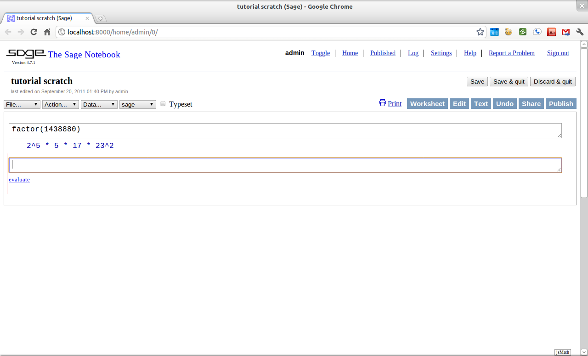
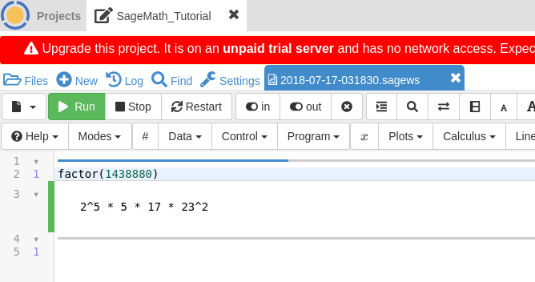

.. index:: About this tutorial

.. _about_tutorial:

*********************
 About this tutorial
*********************
.. _about_tutorial_introduction:

Introduction
============

.. index:: How to use this tutorial

.. _about_tutorial_howto:

How to use this tutorial
------------------------

This tutorial is divided into four parts. This part,
:ref:`about_tutorial`,  discusses some basic properties of SageMathMath, introduces you to the
structure of the tutorial,  and explains how to contribute to the project if you so desire.

The second part, :ref:`sage_as_a_calculator`,  covers  topics such as how to do arithmetic, evaluate functions, create simple graphs, solve equations and do  basic calculus. We call this section :ref:`sage_as_a_calculator` because most of the topics covered are those that are commonly done with a standard graphing calculator. The target audience for this section is any motivated pre-calculus or calculus student.

:ref:`programming_in_sage`  introduces the reader to some more *advanced* topics such as  how SageMath handles numbers; how to define and use variables and functions; how to manipulate lists, strings, and sets; and SageMath *universes* and *coercion*.

The final part, :ref:`mathematical_structures`,  introduces the reader to topics that one finds in  a college-level curriculum: linear algebra, number theory, groups, rings, fields, etc.

Since this tutorial is an introduction to SageMath, we will be using examples to demonstrate ideas and the reader is encouraged to follow along as we progress by entering the commands into their own copy of SageMath. We have included exercises for practice and problems for more extensive exploration of a given topic. The reader is also encouraged to do many of these.

While the tutorial mostly progresses in a linear fashion, we still include at the beginning of each section a list of the most important prerequisite topics. This list follows the text "You should be familiar with." and by clicking one of those links you will be taken to the relevant portion of the tutorial. We have also included links to further information and other on-line references. These will follow the "**See also:**" text.

Some sections may contain numbered citations such as "[1]_." The list of these citations will be at the bottom of a section with at least one citation. These citations will direct the reader to texts which contain more information about the topic being presented.

**References:**

.. [1] William A. Stein et al. Sage Mathematics Software (Version 4.7.1),
   The Sage Development Team, 2011, http://www.sagemath.org.

.. index:: Getting Started

.. _helpful_tips:

Getting Started
===============

.. index:: About SageMath

.. _about_sage:

About SageMath
--------------

SageMath (previously Sage or SAGE) is a free open source mathematical software system based on the
Python programming language. Originally created for research into
mathematics, it has been evolving into a powerful tool for math
education. It combines numerous other mathematical software packages
with a single interface, using the `Python <http://www.python.org>`_ programming language. By learning SageMath, you are also learning a lot about Python.

As an open source project, SageMath invites contributions from all of its users. This tutorial is one of many sources of information for learning about how to use SageMath. For more information see the SageMath project's  `website <http://www.sagemath.org>`_.

.. index:: command line, notebook

This tutorial assumes that the reader has access to a running copy of SageMath. On most operating systems, installing SageMath usually consists of  downloading the proper package from the project's main `website <http://www.sagemath.org>`_, unwrapping it, and executing `sage` from within. For more information on the process of installing sage see SageMath's `Installation Guide <http://www.sagemath.org/doc/installation>`_.

Once it has been installed and started, SageMath has two ways to enter commands, either from the *command line* or by using the  web-based *notebook*. The notebook interface is similar in design to the interface of *Matlab*, *Mathematica*, or *Maple* and is a popular choice.

A good alternative is to run SageMath in the cloud using `Cocalc <https://cocalc.com>`_. All you need to do is either sign up for a free account or sign in through a Google/Github/Facebook/Twitter account.

Everything that follows the ``sage:`` prompt is a command that we encourage the reader to type in on their own. For example, if we wanted to *factor* the integer :math:`1438880` we would give the following example using SageMath's :func:`.factor` command. ::

  sage: factor(1438880)
  2^5 * 5 * 17 * 23^2

The line after the ``sage:`` contains the output that the user should
expect after properly entering the command.

From the command line the interaction would probably look a bit like this:

.. image:: pics/cmd_example.png
        :alt: Using SageMath at the command line.
	:width: 800px
	:height: 525px

If the user is using the notebook (most likely) the interaction will look a little like:

Whereas in Cocalc it will look like:

.. _help_tabcompletion:

Tab Completion
-----------------------
Next we will discuss how to use a couple of important features of both interfaces; tab-completion and the built-in help system.

.. index:: tab completion

One of the handiest features built into SageMath is the *tab completion* of commands. To use tab completion, just type in the first couple of letters of the command that you would like to use, and then press the tab-key. For instance, suppose that you want to compute :math:`56!` but don't remember the exact command name to do this. A good guess is that the command will have *factorial* somewhere in its name. To see if that guess is correct, just type the first three letters ``fac`` and hit the tab-key. ::

  sage: fac[TAB]
  factor     factorial
  sage: factor

The output tells you that only two SageMath commands begin with ``fac``,  :func:`.factor` and :func:`factorial`. Note that SageMath has already changed the command from ``fac`` to ``factor`` because this is the common root for both commands. Since *factorial* looks like the correct command, we will select this by typing the next letter, ``i``, and hitting the tab key again. ::

  sage: factorial

This time no list is returned because the only command that begins with ``factori`` is :func:`factorial`. So to compute :math:`56!` you just complete the command by adding the argument ``(56)``. ::

  sage: factorial(56)
  710998587804863451854045647463724949736497978881168458687447040000000000000

Another good use of tab-completion is to discover what *methods* an *object* has. Say you have the integer :math:`a = 56` and were wondering what commands SageMath offers to work with integers like :math:`56`. In this case the :math:`a` is our object and we can find all of the methods associated with integers by typing ``a.`` then hitting the tab-key. ::

  sage: a = 56
  sage: a.[TAB]
  a.N                            a.kronecker
  ... A long list of Commands ...
  a.divisors                     a.parent
  a.dump                         a.popcount
  a.dumps                        a.powermod
  a.exact_log                    a.powermodm_ui
  --More--

Do not be intimidated by the length of this list. SageMath is a very powerful system and it can do a lot with integers. On the command line, the ``--More--`` at the bottom of the screen tells you that the list of possible commands is longer than what will fit on a single screen. To scroll through this list a page at a time, jut hit any key and SageMath will display the next page.

On the second page you see that :meth:`.factor` is an option. To use this method, which *factors* :math:`56` into unique prime factors, you enter ``a.factor()``. ::

  sage: a.factor()
  2^3 * 7

Tab-completion can not only reduce the amount of typing needed, but it can be used to *discover* new commands in SageMath.

.. index::  help, help; command line, ?

Help using ?
---------------------

Once you have identified a command that interests you, the next step is to find out exactly *what* this command does and *how* to use it. SageMath has a built-in help system to help you achieve this very goal.

Let's suppose that you wish to compute the *lowest common multiple* of
two integers and are not sure which command does this. A good place to
begin the search is by typing ``l`` at the command prompt and then
hitting the tab-key.  ::

  sage: l[TAB]
  laguerre                    list_plot3d
  lambda                      lk
  laplace                     ll
  latex                       ln
  lattice_polytope            lngamma
  lazy_attribute              load
  lazy_import                 load_attach_path
  lc                          load_session
  lcalc                       loads
  lcm                         local/LIB
  ldir                        local/bin
  ...
  lisp_console                ls
  list                        lucas_number1
  list_composition            lucas_number2
  list_plot                   lx

Once again you have quite a long list of commands from which to select. Scanning down the list, you see the :func:`lcm` command listed which seems like what you are trying to compute. To make sure of this enter ``lcm?``. ::

  sage: lcm?

The output of this command is  a page that explains both the use and the purpose of the command. ::

  Base Class:     <type 'function'>
  String Form:    <function lcm at 0x32db6e0>
  Namespace:      Interactive
  File:           /home/ayeq/sage/local/lib/python2.6/site-packages/sage/rings/arith.py
  Definition:     lcm(a, b=None)
  Docstring:
	 The least common multiple of a and b, or if a is a list and b is
	 omitted the least common multiple of all elements of a.

	 Note that LCM is an alias for lcm.

	 INPUT:

	 * ``a,b`` - two elements of a ring with lcm or

	 * ``a`` - a list or tuple of elements of a ring with lcm

	 EXAMPLES:

	    sage: lcm(97,100)
	    9700
	    sage: LCM(97,100)

Again, there will be a whole lot of information, usually more than will fit on one screen.  On the command line, navigation is easy; the space bar will take you to the next page, and ``b``, or the up-arrow key, will move backward in the documentation. To exit the help system hit the ``q`` key.

.. index:: help; INPUT, help; EXAMPLES, help; DESCRIPTION

When first starting out; the description,  the ``INPUT``, and the ``EXAMPLES`` sections are good sections to read. The description gives a short summary describing what the command does,  ``INPUT`` gives you information on what you should provide as *arguments* to the command, and ``EXAMPLES`` gives concrete examples of the command's usage.

The description in this case is:  ::

  The least common multiple of a and b, or if a is a list and b is
  omitted the least common multiple of all elements of a.
  Note that LCM is an alias for lcm.

From this description, you can be pretty sure that this is the command that you am looking for. Next examine the ``INPUT``: ::

  INPUT:
  * ``a,b`` - two elements of a ring with lcm or
  * ``a`` - a list or tuple of elements of a ring with lcm

Here you see that ``lcm`` can either accept two arguments, for our purposes two integers, or a list of objects. Finally by perusing the ``EXAMPLES`` you can get a good idea on how this command is actually used in practice. ::

       EXAMPLES:

          sage: lcm(97,100)
          9700
          sage: LCM(97,100)
          9700
          sage: LCM(0,2)
          0
          sage: LCM(-3,-5)
          15
          sage: LCM([1,2,3,4,5])
          60
          sage: v = LCM(range(1,10000))   # *very* fast!
          sage: len(str(v))
          4349

Having a comprehensive help system built into SageMath is one of it's best features and the sooner you get comfortable with using it the faster you will be able to use the full power of this CAS.

.. index::  source code; ??

Source  Code, ??
--------------------------

.. seealso::
   `SageMath Screencasts  <http://www.sagemath.org/help-video.html>`_

.. index:: Contributing to the tutorial

.. _contributing:

Contributing to the tutorial
============================

.. index:: contribution, tutorial source, bitbucket, reStructured Text

Additions to this tutorial are encouraged as are suggestions for additional topics for inclusion.

All of this website's source code can be downloaded from the project's `bitbucket <https://bitbucket.org/ayeq123/sdsu-sage-tutorial/>`_. There you will find a complete copy of the source code for generating this website. To build the site from its source, the reader will need to install the `Sphinx Documentation <http://sphinx.poco.org>`_, which is written in the `Python Programming Language <http://www.python.org>`_.  We are excited to see any changes that you make so please let `us <mosullivan@mail.sdsu.edu>`_ know of any new material that you  add. We want this tutorial to be as comprehensive as possible and any assistance toward this goal is welcomed.

The content of this tutorial is written using `reStructured Text <http://sphinx.pocoo.org/rest.html>`_, which is processed by `Sphinx <http://sphinx.pocoo.org/>`_ to produce the HTML and PDF output. Sphinx and reStructured Text are used throughout the official SageMath and Python documentation, so it is useful for contributors to either of these projects.

There are  four parts to the tutorial: :ref:`about_tutorial` has basic instructions about using and amending the tutorial, and the others have mathematical content. :ref:`sage_as_a_calculator` is intended, as the title suggests, to cover straightforward computations, plotting graphs, and content that one might find in a high school algebra course, introductory statistics or calculus.  We intend it to be  accessible to an entering college student, or to a bright high school student.

"Programming in SageMath" eases the transition to higher level mathematics by treating topics that relate to the interface between mathematical concepts and computational issues. The first chapter covers universes and coercion   (rationals, reals, booleans etc.);  variables; and basic structures like lists, sets and strings.  The second chapter covers; programming essentials like  conditionals and iterative computation; file handling and data handling; etc.   The third chapter discusses mathematical software packages within SageMath.
Finally, there is a brief discussion of interactive demonstrations with the notebook.

"Mathematical Structures" is written at a more sophisticated level than the earlier material, since the intended audience is college students taking upper division math courses.  The emphasis is on learning about specific mathematical structures that have a SageMath class associated to them.  We intend each chapter to ne independent of the others.

.. seealso::
   `reStructured Text Primer <http://sphinx.pocoo.org/rest.html>`_

.. _credits_and_license:

Credits and License
-------------------

The content and code for this tutorial was  written by David Monarres
under the supervision of Mike O'Sullivan and was supported by a
generous grant from  San Diego State University's President's
Leadership Fund.
The tutorial  is licensed under the
`Creative Commons Attribution-ShareAlike 3.01 <http://creativecommons.org/licenses/by-sa/3.0/>`_ License. You are
free to share and to remix, but attribution should be given to the
original funder and creators. You may add your name to the list of contributors below.

Other contributors include:

*  Ryan Rosenbaum.
