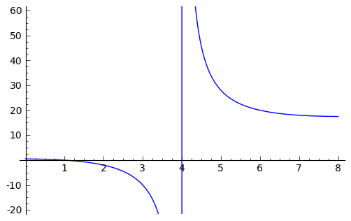
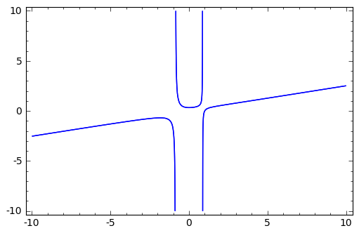
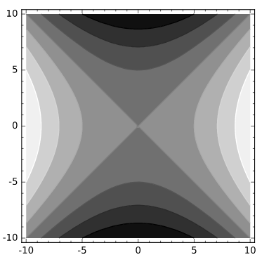

.. index:: SageMath as a Calculator

.. _sage_as_a_calculator:

====================
SageMath as a Calculator
====================

This part of the tutorial examines commands that  allow you to use SageMath much like a graphing calculator.  The chapter on  arithmetic and functions and the chapter on solving equations and inequalities serve as a foundation for the rest of the material.   The chapters on plotting, statistics and  calculus are independent of each other, although plotting may be useful to read next since plotting graphs is so is useful in calculus and in statistics.

.. index:: Basic Arithmetic and Functions

.. _arithmetic_and_functions:

Arithmetic and Functions
========================

.. index:: Basic Arithmetic

.. _basic_arithmetic:

Basic Arithmetic
----------------

.. index:: arithmetic, addition, multiplication, subtraction, division, exponentiation

The basic arithmetic operators are ``+``, ``-``, ``*``, and ``/`` for addition, subtraction, multiplication and division, while ``^`` is used for exponents. ::

  sage: 1+1
  2
  sage: 103-101
  2
  sage: 7*9
  63
  sage: 7337/11
  667
  sage: 11/4
  11/4
  sage: 2^5
  32

The ``-`` symbol in front of a number indicates that it is negative. ::

  sage: -6
  -6
  sage: -11+9
  -2

.. index:: Order of operations

As we would expect, SageMath adheres to the standard order of operations,
PEMDAS (parenthesis, exponents, multiplication, division, addition,
subtraction). ::

  sage: 2*4^2+1
  33
  sage: (2*4)^2+1
  65
  sage: 2*4^(2+1)
  128
  sage: -3^2
  -9
  sage: (-3)^2
  9

When dividing two integers, there is a subtlety; whether SageMath will return a fraction or it's decimal approximation. Unlike most graphing calculators, SageMath will attempt to be as *precise* as possible and will return the fraction unless told otherwise. One way to tell SageMath that we *want* the decimal approximation is to include a decimal in the expression itself. ::

	sage: 11/4.0
	2.75000000000000
	sage: 11/4.
	2.75000000000000
	sage: 11.0/4
	2.75000000000000
	sage: 11/4*1.
	2.75000000000000

**Exercises:**

   #. Divide :math:`28` by :math:`2` raised to the 5th power as a  rational number, then get it's decimal approximation.

   #. Compute a decimal approximation of :math:`\sqrt{2}`

   #. Use sage to compute ``(-9)^(1/2)``. Describe the output.

.. index:: Division and factoring

.. _division_and_factoring:

Integer Division and Factoring
------------------------------------------

    You should be familiar with ":ref:`basic_arithmetic`"

Sometimes when we divide, the division operator doesn't give us all of the information that we want. Often we would like to not just know what the reduced fraction is, or even it's decimal approximation, but rather the unique *quotient* and the *remainder* that are the consequence of the division.

.. index:: division, qutient, remainder, modulus

To calculate the quotient we use the ``//`` operator and the ``%`` operator is used for the remainder. ::

	sage: 14 // 4
	3
	sage: 14 % 4
	2

.. index:: divmod

If we want both the quotient and the remainder all at once, we use the :func:`.divmod` command ::

	sage: divmod(14,4)
	(3, 2)

.. index:: divides

Recall that :math:`b` *divides* :math:`a` if :math:`0` is the remainder when we divide the two integers. The integers in SageMath have a built-in command ( or 'method' ) which allows us to check whether one integer divides another. ::

	sage: 3.divides(15)
	True
	sage: 5.divides(17)
	False

.. index:: divisors

A related command is the :meth:`.divisors` method. This method returns
a list of all positive divisors of the integer specified. ::

	sage: 12.divisors()
	[1, 2, 3, 4, 6, 12]
	sage: 101.divisors()
	[1,101]

.. index:: prime, is_prime

When the divisors of an integer are only :math:`1` and itself then we say that the number is *prime*. To check if a number is prime in sage, we use it's :meth:`.is_prime` method. ::

	sage: (2^19-1).is_prime()
	True
	sage: 153.is_prime()
	False

Notice the parentheses around ``2^19 -1`` in the first example. They are important to the order of operations in SageMath, and if they are not included then SageMath will compute something very different than we intended. Try evaluating ``2^19-1.is_prime()`` and notice the result.  When in doubt, the judicious use of *parenthesis* is encouraged.

.. index:: factor, factoring

We use the :meth:`.factor` method to compute the *prime factorization* of an integer. ::

	sage: 62.factor()
	2 * 31
	sage: 63.factor()
	3^2 * 7

.. index:: divisors, prime_divisors

If we are interested in simply knowing which prime numbers divide an integer, we may use it's :meth:`.prime_divisors` (or :meth:`.prime_factors`) method. ::

	sage: 24.prime_divisors()
	[2, 3]
	sage: 63.prime_factors()
	[3, 7]

.. index:: greatest common divisor, least common multiple, gcd, lcm

Finally, we have the *greatest common divisor* and *least common multiple* of a pair of integers. A *common divisor* of two integers is any integer which is a divisor of each, whereas a *common multiple* is a number which both integers divide.

The greatest common divisor (gcd), not too surprisingly, is the largest of all of these common divisors. The :func:`.gcd` command is used to calculate this divisor. ::

  sage: gcd(14,63)
  7
  sage: gcd(15,19)
  1

Notice that if two integers share no common divisors, then their gcd will be :math:`1`.

The least common multiple is the smallest integer which both integers divide. The :func:`.lcm` command is used to calculate the least common multiple. ::

  sage: lcm(4,5)
  20
  sage: lcm(14,21)
  42

**Exercises:**

  #. Find the quotient and remainder when diving :math:`98` into :math:`956`.
  #. Use SageMath to verify that the quotient and remainder computed above are correct.
  #. Use SageMath to determine if :math:`3` divides :math:`234878`.
  #. Compute the list of divisors for each of the integers :math:`134,\ 491,\ 422` and :math:`1002`.
  #. Which of the integers above are *prime*?
  #. Calculate :math:`\mathrm{gcd}(a,b)`,  :math:`\mathrm{lcm}(a,b)` and :math:`a \cdot b` for the pairs of integers :math:`\left(2,5\right),\ \left(4,10\right)` and :math:`\left(18,51\right)`. How do the gcd, lcm and the product of the numbers relate?

.. index:: Standard functions and constants

.. _basic_functions_and_constants:

Standard Functions and Constants
-------------------------------------------------

..
    You should be familiar with ":ref:`basic_arithmetic`"

SageMath includes nearly all of the standard functions that one encounters
when studying mathematics. In this section, we shall cover some of the
most commonly used functions: the *maximum*, *minimum*, *floor*,
*ceiling*, *trigonometric*, *exponential*, and *logarithm* functions.
We will also see many of the standard mathematical constants; such as *Euler's constant* (:math:`e`), :math:`\pi`, and *the golden ratio* (:math:`\phi`).

.. index:: maximum, minimum, max, min

The :func:`.max` and :func:`.min` commands return the largest and smallest of a set of numbers. ::

	sage: max(1,5,8)
	8
	sage: min(1/2,1/3)
	1/3

We may input any number of arguments into the max and min functions.

.. index:: absolute value, abs

In SageMath we use the :func:`abs` command to compute the *absolute value* of
a real number. ::

	sage: abs(-10)
	10
	sage: abs(4)
	4

.. index:: floor, ceiling, ceil

The :func:`.floor` command rounds a number down to the nearest integer, while :func:`.ceil` rounds up. ::

	sage: floor(2.1)
	2
	sage: ceil(2.1)
	3

We need to be very careful while using :func:`.floor` and :func:`.ceil`. ::

	sage: floor(1/(2.1-2))
	9

This is clearly not correct: :math:`\lfloor 1/(2.1-2)\rfloor = \lfloor 1/.1 \rfloor = \lfloor 10 \rfloor = 10`. So what happened? ::

	sage: 1/(2.1-2)
	9.99999999999999

Computers store real numbers in *binary*, while we are accustomed to using the decimal representation. The :math:`2.1` in decimal notation is quite simple and short, but when converted to binary it is :math:`10.0001\overline{1}=10.0001100110011\ldots`

Since computers cannot store an infinite number of digits, this gets rounded off somewhere, resulting in the slight error we saw. In SageMath, however, *rational numbers* (fractions) are exact, so we will never see this rounding error. ::

  sage: floor(1/(21/10-2))
  10

Due to this, it is often a good idea to use rational numbers whenever possible instead of decimals, particularly if a high level of precision is required.

.. index:: square root, nth root, sqrt, fractional powers

The :func:`.sqrt` command calculates the *square root* of a real number. As we have seen earlier with fractions, if we want a decimal approximation we can get this by giving a decimal number as the input. ::

  sage: sqrt(3)
  sqrt(3)
  sage: sqrt(3.0)
  1.73205080756888

To compute other roots, we use a rational exponent. SageMath can compute any rational power. If either the exponent or the base is a decimal then the output will be a decimal. ::

  sage: 3^(1/2)
  sqrt(3)
  sage: (3.0)^(1/2)
  1.73205080756888
  sage: 8^(1/2)
  2*sqrt(2)
  sage: 8^(1/3)
  2

.. index:: trigonometric functions, sin, cos, tan

SageMath also has available all of the standard trigonometric functions: for sine and cosine we use :func:`.sin` and :func:`.cos`. ::

  sage: sin(1)
  sin(1)
  sage: sin(1.0)
  0.841470984807897
  sage: cos(3/2)
  cos(3/2)
  sage: cos(3/2.0)
  0.0707372016677029

Again we see the same behavior that we saw with :func:`sqrt`, SageMath will give us an exact answer.  You might think that since there is no way to simplify ``sin(1)``,  why bother?  Well, some expressions involving sine can indeed be simplified. For example, an important identity from geometry is :math:`\sin(\pi/3 ) = \sqrt{3}/2`. SageMath has a built-in symbolic :math:`\pi`, and understands this identity::

  sage: pi
  pi
  sage: sin(pi/3)
  1/2*sqrt(3)

.. index:: decimal approximation, n

When we type :obj:`.pi` in SageMath we are dealing exactly with :math:`\pi`, not some numerical approximation. However, we can call for a numerical approximation using the :meth:`.n` method::

  sage: pi.n()
  3.14159265358979
  sage: sin(pi)
  0
  sage: sin(pi.n())
  1.22464679914735e-16

We see that when using the symbolic :obj:`.pi`, SageMath returns the exact result. However,  when we use the approximation we get an approximation back. ``e-15`` is a shorthand for :math:`10^{-15}` and the number ``1.22464679914735e-16`` should be zero, but there are errors introduced by the approximation. Here are a few examples of using the symbolic, precise :math:`\pi` vs the numerical approximation: ::

  sage: sin(pi/6)
  1/2
  sage: sin(pi.n()/6)
  0.500000000000000
  sage: sin(pi/4)
  1/2*sqrt(2)
  sage: sin(pi.n()/4)
  0.707106781186547

Continuing on with the theme, there are some lesser known special angles for which the value of sine or cosine can be cleverly simplified. ::

  sage: sin(pi/10)
  1/4*sqrt(5) - 1/4
  sage: cos(pi/5)
  1/4*sqrt(5) + 1/4
  sage: sin(5*pi/12)
  1/12*(sqrt(3) + 3)*sqrt(6)

.. index:: inverse trigonometric functions, hyperbolic trigonometric functions, arctan, sinh

Other trigonometric functions, the inverse trigonometric functions and hyperbolic functions are also available. ::

  sage: arctan(1.0)
  0.785398163397448
  sage: sinh(9.0)
  4051.54190208279

.. index:: natural base, e

Similar to :obj:`pi` SageMath has a built-in symbolic constant for the number :math:`e`, the base of the natural logarithm. ::

  sage: e
  e
  sage: e.n()
  2.71828182845905

.. index:: logarithms, log, ln

While some might be familiar with using ``ln(x)`` for natural log and ``log(x)`` to represent logarithm base :math:`10`, in SageMath both represent logarithm
base :math:`e`.  We may specify a different base as a second argument to the command: to compute :math:`\log_{b}(x)` in SageMath we use the command ``log(x,b)``. ::

  sage: ln(e)
  1
  sage: log(e)
  1
  sage: log(e^2)
  2
  sage: log(10)
  log(10)
  sage: log(10.0)
  2.30258509299405
  sage: log(100,10)
  2

.. index:: exponential function, exp

Exponentiation base :math:`e` can done using both the :func:`.exp` function and by raising the symbolic constant ``e`` to a specified power. ::

  sage: exp(2)
  e^2
  sage: exp(2.0)
  7.38905609893065
  sage: exp(log(pi))
  pi
  sage: e^(log(2))
  2

**Exercises:**

  #. Compute the floor and ceiling of :math:`2.75`.
  #. Compute the logarithm base :math:`e` of  :math:`1/1000000`, compute the logarithm base 10 of  :math:`1/1000000`, then compute the ratio.  What should the answer be?
  #. Compute the logarithm base 2 of :math:`64`.
  #. Compare :math:`e^{i \pi}` with a numerical approximation of it using ``pi.n()``.
  #. Compute :math:`\sin(\pi/2)`, :math:`\cot(0)` and :math:`\csc(\pi/16)`.

.. index:: Solving equations and inequalities

.. _solving_equations_inequalities:

Solving Equations and Inequalities
=====================================

.. index:: Solving for x

.. _solving_x:

Solving for x
-------------------------------------------------

  You should be familiar with ":ref:`basic_arithmetic`" and ":ref:`basic_functions_and_constants`"

.. index:: equations, inequalities, ==, <=, >=, True, False

In SageMath, equations and inequalities are defined using the *operators* ``==``, ``<=``, and ``>=`` and will return either ``True``, ``False``, or, if there is a variable, just the equation/inequality. ::

  sage: 9 == 9
  True
  sage: 9 <= 10
  True
  sage: 3*x - 10 == 5
  3*x - 10 == 5

.. index:: solving equations, solve

To solve an equation or an inequality we use using the, aptly named, :func:`.solve` command. For the moment, we will only solve for :math:`x`.  The section on variables below explains how to use other variables. ::

	sage: solve(3*x - 2 == 5,x)
	[x == (7/3)]
	sage: solve( 2*x -5 == 1, x)
	[x == 3]
	sage: solve( 2*x - 5 >= 17,x)
	[[x >= 11]]
	sage: solve( 3*x -2 > 5, x)
	[[x > (7/3)]]

Equations can have multiple solutions, SageMath returns all solutions found as a list. ::

	sage: solve( x^2 + x  == 6, x)
	[x == -3, x == 2]
	sage: solve(2*x^2 - x + 1 == 0, x)
	[x == -1/4*I*sqrt(7) + 1/4, x == 1/4*I*sqrt(7) + 1/4]
	sage: solve( exp(x) == -1, x)
	[x == I*pi]

The solution set of certain inequalities consists of the union and intersection of open intervals. ::

	sage: solve( x^2 - 6 >= 3, x )
	[[x <= -3], [x >= 3]]
	sage: solve( x^2 - 6 <= 3, x )
	[[x >= -3, x <= 3]]

The :func:`.solve` command will attempt to express the solution of an
equation without the use of floating point numbers. If this cannot be
done, it will return the solution in a symbolic form. ::

	sage: solve( sin(x) == x, x)
	[x == sin(x)]
	sage: solve( exp(x) - x == 0 , x)
	[x == e^x]
	sage: solve( cos(x) - sin(x) == 0 , x)
	[sin(x) == cos(x)]
	sage: solve( cos(x) - exp(x) == 0 , x)
	[cos(x) == e^x]

.. index:: find_root

To find a numeric approximation of the solution we can use the
:func:`.find_root` command. Which requires both the expression and a closed
interval on which to search for a solution. ::

	sage: find_root(sin(x) == x, -pi/2 , pi/2)
	0.0
	sage: find_root(sin(x) == cos(x), pi, 3*pi/2)
	3.9269908169872414

This command will only return one solution on the specified interval, if one exists. It will not find the complete solution set over the entire real numbers.
To find a complete set of solutions, the reader must use :func:`.find_root` repeatedly over cleverly selected intervals. Sadly, at this point, SageMath cannot do all of the thinking for us. This feature is not planned until SageMath 10.

.. index:: Declaring Variables

.. _declare_variables:

Declaring Variables
-------------------

.. index:: symbolic variables, var

In the previous section we only solved equations in one variable, and we always used :math:`x`. When a session is started, SageMath creates one symbolic variable, :math:`x`, and it can be used to solve equations.  If you want to use  an additional symbolic variable, you have to *declare it*  using the :func:`.var` command. The name of a symbolic variable can be a letter, or a combination of letters and numbers::

	sage: y,z,t = var("y z t")
	sage: phi, theta, rho = var("phi theta rho")
	sage: x1, x2 = var("x1 x2")

.. note::
	Variable names cannot contain spaces, for example "square root"
	is not a valid variable name, whereas "square_root" is.

Attempting to use a symbolic variable before it has been declared will result in a :exc:`.NameError`. ::

	sage: u
	...
	NameError: name 'u' is not defined
	sage: solve (u^2-1,u)
 	NameError                                 Traceback (most recent call last)
	NameError: name 'u' is not defined

.. index:: restore

We can un-declare a symbolic variable, like the variable ``phi`` defined above,  by using the :func:`.restore`
command. ::

	sage: restore('phi')
	sage: phi
	...
	NameError: name 'phi' is not defined

.. index:: Solving equations with several variables

.. _solve_several_variables:

Solving Equations with Several Variables
-------------------------------------------------

Small systems of linear equations can be also solved using  :func:`.solve`, provided that all the symbolic variables have been declared.
The equations must be input as a list, followed by the symbolic variables.  The result may be  either a unique solution, infinitely many solutions, or no solutions at all. ::

	sage: solve( [3*x - y == 2, -2*x -y == 1 ], x,y)
	[[x == (1/5), y == (-7/5)]]
	sage: solve( [	2*x + y == -1 , -4*x - 2*y == 2],x,y)
	[[x == -1/2*r1 - 1/2, y == r1]]
	sage: solve( [	2*x - y == -1 , 2*x - y == 2],x,y)
	[]

In the second equation above, ``r1`` signifies that there is a free
variable which parametrizes the solution set. When there is more than
one free variable, SageMath enumerates them ``r1,r2,..., rk``. ::

	sage: solve([ 2*x + 3*y + 5*z == 1, 4*x + 6*y + 10*z == 2, 6*x + 9*y + 15*z == 3], x,y,z)
	[[x == -5/2*r1 - 3/2*r2 + 1/2, y == r2, z == r1]]

:func:`.solve` can be very slow for large systems of equations. For these systems, it is best to use the linear algebra functions as they are quite efficient.

Solving inequalities in several variables can lead to complicated expressions, since the regions they define are complicated. In the example below, SageMath's solution is a list containing the point of interesection of the lines, then  two rays, then the region between the two rays. ::

        sage: solve([ x-y >=2, x+y <=3], x,y)
	[[x == (5/2), y == (1/2)], [x == -y + 3, y < (1/2)], [x == y + 2, y < (1/2)], [y + 2 < x, x < -y + 3, y < (1/2)]]
	sage: solve([ 2*x-y< 4, x+y>5, x-y<6], x,y)
	[[-y + 5 < x, x < 1/2*y + 2, 2 < y]]

**Exercises:**

  #. Find all of the solutions to the equation :math:`x^3 - x = 7x^2 - 7`.
  #. Find the complete solution set for the inequality :math:`\left\vert t - 7 \right\vert \geq 3`.
  #. Find all :math:`x` and :math:`y` that satisfy both :math:`2x + y = 17` and :math:`x - 3y = -16`.
  #. Use :func:`find_root` to find a solution of the equation :math:`e^{x} = \cos(x)` on the interval :math:`\left[-\pi/2, 0\right]`.
  #. Change the command above so that :func:`find_root` finds the other solution in the same interval.

.. index:: Calculus Commands

.. _calculus:

Calculus
========

    You should be familiar with :ref:`basic_arithmetic`, :ref:`basic_functions_and_constants`, and :ref:`declare_variables`

.. index:: defining mathematical functions

SageMath has many commands that are useful for the study of differential and integral calculus. We will begin our investigation of these command by defining a few functions that we will use throughout the chapter. ::

  sage: f(x) = x*exp(x)
  sage: f
  x |--> x*e^x
  sage: g(x) = (x^2)*cos(2*x)
  sage: g
  x |--> x^2*cos(2*x)
  sage: h(x) = (x^2 + x - 2)/(x-4)
  sage: h
  x |--> (x^2 + x - 2)/(x-4)

SageMath uses ``x |-->`` to tell you that the expression returned is actually a function and not just a number or string. This means that we can *evaluate* these expressions just like you would expect of any function. ::

  sage: f(1)
  e
  sage: g(2*pi)
  4*pi^2
  sage: h(-1)
  2/5

With these functions defined, we will look at how we can use SageMath to compute the *limit* of these functions.

.. index:: Limits

.. _limits:

Limits
------

.. index:: limit

The limit of :math:`f(x) = xe^{x}` as :math:`x \rightarrow 1` is computed in SageMath by entering the following command into SageMath: ::

  sage: limit(f, x=1)
  e

We can do the same with :math:`g(x)`. To evaluate the limit of :math:`g(x) = x^{2} \cos(2x)` as :math:`x \rightarrow 2` we enter: ::

  sage: limit(g, x=2)
  4*cos(4)

The functions :math:`f(x)` and :math:`g(x)` aren't all that exciting as far as limits are concerned since they are both *continuous* for all real numbers. But :math:`h(x)` has a discontinuity at :math:`x=4`, so to investigate what is happening near this discontinuity we will look at the limit of :math:`h(x)` as :math:`x \rightarrow 4`: ::

  sage: limit(h, x = 4)
  Infinity

Now this is an example of why we have to be a little careful when using computer algebra systems. The limit above is not exactly correct. See the graph of :math:`h(x)` near this discontinuity below.

.. index:: Limits; directional

What we have when :math:`x=4` is a *vertical asymptote* with the function tending toward *positive* infinity if :math:`x` is larger than :math:`4` and *negative* infinity from when :math:`x` less than :math:`4`. We can takes these *directional* limits using SageMath to confirm this by supplying the extra *dir* argument. ::

  sage: limit(h, x=4, dir="right")
  +Infinity
  sage: limit(h, x=4, dir="left")
  -Infinity

.. index:: Derivatives

.. _derivatives:

Derivatives
-----------

.. index:: derivative

The next thing we are going to do is use SageMath to compute the *derivatives* of the functions that we defined earlier. For example, to compute :math:`f^{\prime}(x)`, :math:`g^{\prime}(x)`, and :math:`h^{\prime}(x)` we will use the :func:`.derivative` command. ::

  sage: fp  =  derivative(f,x)
  sage: fp
  x |--> x*e^x + e^x
  sage: gp =  derivative(g, x)
  sage: gp
  x |--> -2*x^2*sin(2*x) + 2*x*cos(2*x)
  sage: hp  = derivative(h,x)
  sage: hp
  x |--> (2*x + 1)/(x - 4) - (x^2 + x - 2)/(x - 4)^2

.. index:: Derivatives; partial

The first argument is the function which you would like to differentiate and the second argument is the variable with which you would like to differentiate with respect to. For example, if I were to supply a different variable, SageMath will hold :math:`x` constant and take the derivative with respect to that variable. ::

  sage: y = var('y')
  sage: derivative(f,y)
  x |--> 0
  sage: derivative(g,y)
  x |--> 0
  sage: derivative(h,y)
  x |--> 0

The :func:`.derivative` command returns another function that can be evaluated like any other function. ::

  sage: fp(10)
  11*e^10
  sage: gp(pi/2)
  -pi
  sage:
  sage: hp(10)
  1/2

.. index:: Finding critical points

With the *derivative function* computed, we can then find the *critical points* using the :func:`.solve` command. ::

  sage: solve( fp(x) == 0, x)
  [x == -1, e^x == 0]
  sage: solve( hp(x) == 0, x)
  [x == -3*sqrt(2) + 4, x == 3*sqrt(2) + 4]
  sage: solve( gp(x) == 0, x)
  [x == 0, x == cos(2*x)/sin(2*x)]

.. index:: Line tangent to a curve

Constructing the line *tangent* to our functions at the point :math:`\left(x, f\left(x\right)\right)` is an important computation which is easily done in SageMath. For example, the following command will compute the line tangent to :math:`f(x)` at the point :math:`\left(0,f(0)\right)`. ::

  sage: T_f = fp(0)*( x - 0 ) + f(0)
  sage: T_f
  x

The same can be done for :math:`g(x)` and :math:`h(x)`. ::

  sage: T_g = gp(0)*( x - 0 ) + g(0)
  sage: T_g
  0
  sage: T_h = hp(0)*( x - 0 ) + h(0)
  sage: T_h
  -1/8*x + 1/2

.. index:: Integrals

.. _integrals:

Integrals
---------

.. index:: integral, Integrals; definite, Integrals; indefinite, Anti-derivative

SageMath has the facility to compute both *definite* and *indefinite* integral for many common functions. We will begin by computing the *indefinite* integral, otherwise known as the *anti-derivative*,  for each of the functions that we defined earlier. This will be done by using the :func:`.integral` command which has arguments that are similar to :func:`.derivative`. ::

  sage: integral(f,x)
  x |--> (x - 1)*e^x
  sage: integral(g, x)
  x |--> 1/4*(2*x^2 - 1)*sin(2*x) + 1/2*x*cos(2*x)
  sage: integral(h, x)
  x |--> 1/2*x^2 + 5*x + 18*log(x - 4)

The function that is returned is only *one* of the many anti-derivatives that exist for each of these functions.
The others differ by a constant. We can verify that we have indeed computed the *anti-derivative* by taking the derivative of our indefinite integrals. ::

  sage: derivative(integral(f,x), x )
  x |--> (x - 1)*e^x + e^x
  sage: f
  x |--> x*e^x
  sage: derivative(integral(g,x), x )
  x |--> 1/2*(2*x^2 - 1)*cos(2*x) + 1/2*cos(2*x)
  sage: derivative(integral(h,x), x )
  x |--> x + 18/(x - 4) + 5

Wait, none of these look right. But a little algebra, and the use of a trig-identity or two in the case of ``1/2*(2*x^2 - 1)*cos(2*x) + 1/2*cos(2*x)``, you will see that they are indeed the same.

It should also be noted that there are some functions which are continuous and yet there doesn't exist a *closed form* integral. A common example is :math:`e^{-x^2}` which forms the basis for the *normal distribution* which is ubiquitous throughout statistics.  The antiderivative for :math:`er^{-x^2}` is commonly called  :math:`\mathrm{erf}`, otherwise known as the *error function*. ::

  sage: y(x) = exp(-x^2)
  sage: integral(y,x)
  x |--> 1/2*sqrt(pi)*erf(x)

We can also compute the *definite* integral for the functions that we defined earlier. This is done by specifying the *limits of integration* as addition arguments. ::

  sage: integral(f, x,0,1)
  x |--> 1
  sage: integral(g,x,0,1)
  x |--> 1/4*sin(2) + 1/2*cos(2)
  sage: integral(h, x,0,1)
  x |--> 18*log(3) - 18*log(4) + 11/2

In each case above, SageMath returns a *function* as its result. Each of these functions is a constant function, which is what we would expect. As it was pointed out earlier, SageMath will return the expression that retains the most precision and will not use decimals unless told to. A quick way to tell SageMath that an approximation is desired is wrap the :func:`.integrate` command with :func:`.n`, the numerical approximation command.  ::

  sage: n(integral(f, x,0,1))
  1.00000000000000
  sage: n(integral(g, x,0,1))
  0.0192509384328492
  sage: n(integral(h, x,0,1))
  0.321722695867944

.. index:: Taylor

.. _taylor:

Taylor Series Expansion
-----------------------

Another interesting feature of SageMath is the possibility to compute `Taylor Series <https://en.wikipedia.org/wiki/Taylor_series>`_ expansions around a point. At first we show how to expand around 0, also called Mclaurin series. Let us give an example with the function :math:`g(x) = \cos(x)`. ::

  sage: g = cos(x); g
  cos(x)
  sage: g_taylor = g.taylor(x,0,3)
  -1/2*x^2 + 1

The first argument in g.taylor() is the independent variable of our function, the second argument is the point around with we are expanding, and the third argument is the order of accuracy of the expansion, i.e. where we truncate it. The above case was a pretty simple one, but sometimes you might have to compute a much harder Taylor expansion. For instance, let us try to expand the function :math:`f(x) = \exp(x^{2})\sin(x-5)` around the point :math:`\x=2` up to order 3. ::

  sage: f = exp(^x^3)*sin(x-5); f
  e^(x^3)*sin(x - 5)
  sage: f_taylor = f.taylor(x,2,3); f_taylor
  1/6*(x - 2)^3*(467*cos(3) - 2130*sin(3))*e^8 + 1/2*(x - 2)^2*(24*cos(3) - 155*sin(3))*e^8 + (x - 2)*(cos(3) - 12*sin(3))*e^8 - e^8*sin(3)

Now the outcome of this computation might be a bit convoluted to visualize, therefore, another interesting feature of SageMath is the possibility of print the outcome in `Latex <https://www.latex-project.org/>`_ format, which is much nicer to the eye. ::

  sage: print; show(f_taylor)

.. image:: pics/Taylor_tex.png
        :alt: Using SageMath at the command line.
	:width: 800px
	:height: 525px

**Exercises:**

  #. Use SageMath to compute the following limits:

     a) :math:`\lim_{x \rightarrow 2} \frac{x^{2} + 2 \, x - 8}{x-2}`
     b) :math:`\lim_{x \rightarrow (\pi/2)^{+}} \sec(x)`
     c) :math:`\lim_{x \rightarrow (\pi/2)^{-}} \sec(x)`

  #. Use SageMath to compute the following *derivatives* with respect to the specified variables:

     a) :math:`\frac{d}{dx}\left[ x^{2}e^{3x}\cos(2x) \right]`
     b) :math:`\frac{d}{dt}\left[\frac{t^2 + 1}{t-2}\right]` *(remember to define ``t``)*
     c) :math:`\frac{d}{dy}\left[ x\cos(x)\right]`

  #. Use SageMath to compute the following integrals:

     a) :math:`\int \frac{x+1}{x^2 + 2x + 1}dx`
     b) :math:`\int_{-\pi/4}^{\pi/4} \sec(x) dx`
     c) :math:`\int x e^{-x^{2}} dx`

  #. Use SageMath to compute the Taylor series expansion of the following functions:

     a) :math:`\sin(x)*\cos(x)` around :math:`x=0`, order 3
     b) :math:`\(x-2)*\ln(x/2)` around :math:`x=1`, order 4
     c) :math:`\tan(x+5) - \exp(x^2)`, around :math:`x=\pi`, order 5

.. index:: Statistics

.. _basic_stats:

Statistics
================

You should be familiar with :ref:`basic_arithmetic`

In this section we will discuss the use of some of the basic descriptive statistic functions availble for use in SageMath.

.. index:: random

To demonstrate their usage we will first generate a pseudo-random list
of integers from 0 to 100 to describe. The :func:`.random` function generates a random number from :math:`[0,1)`, so we will use a trick to generate integers in this specific range. Note, by the nature of random number generation your list of numbers will be different. ::

	sage: data = [	int(random()*(100-0) + 0)  for i in [ 1 .. 20 ] ]
	sage: data
	[78, 43, 6, 50, 47, 94, 37, 70, 66, 32, 1, 34, 93,
	30, 99, 82, 22, 74, 18, 40]

.. index:: mean, median, mode, variance, standard deviation, std

We can compute the mean, median, mode, variance, and standard
deviation of this data. ::

	sage: mean(data)
	254/5
	sage: median(data)
	45
	sage: mode(data)
	[32, 1, 66, 99, 82, 37, 6, 40, 74, 43,
	34, 78, 47, 50, 30, 22, 18, 70, 93, 94]
	sage: variance(data)
	83326/95
	sage: std(data)
	sqrt(83326/95)

Note that both the standard deviation and variance are computed in their unbiased forms. It we want to bias these measures then you can use the ``bias=True`` option.

.. index:: moving_average

We can also compute a rolling, or moving, average of the data with the :func:`.moving_average`. ::

	sage: moving_average(data,4)
	[177/4,73/2,197/4,57,62,267/4,205/4,169/4,
	133/4,40,79/2,64,76,233/4,277/4,49,77/2]
	sage: moving_average(data,10)
	[523/10, 223/5,437/10,262/5,252/5, 278/5,
	272/5,529/10,533/10,97/2,493/10]
	sage: moving_average(data,20)
	[254/5]

**Exercises:**

  #. Use SageMath to generate a list of 20 random integers.
  #. The heights of eight students, measured in inches, are :math:`71,\ 73,\  59,\ 62,\ 65,\ 61,\ 73,\ 61`. Find the *average*, *median* and *mode* of the heights of these students.
  #. Using the same data, compute the *standard deviation* and *variance* of the sampled heights.
  #. Find the *range* of the heights. (*Hint: use the* :func:`.max` *and* :func:`.min` *commands*)

.. index:: Plotting

.. _basic_plotting:

Plotting
========

.. _2d_plotting_and_graphics:

2D Graphics
-----------

    You should be familiar with :ref:`basic_functions_and_constants` and :ref:`solving_equations_inequalities`

SageMath has many ways for us to visualize the mathematics that we are working with. In this section we will quickly get you up to speed with some of the basic commands used when plotting functions and working with graphics.

.. index:: plot, Plotting; 2D,  show, Graphics

To produce a basic plot of :math:`\sin(x)` from :math:`x=-\frac{\pi}{2}` to :math:`x=\frac{\pi}{2}` we will use the :func:`.plot()` command. ::

	sage: f(x) = sin(x)
	sage: p = plot(f(x), (x, -pi/2, pi/2))
	sage: p.show()

.. image:: pics/sin_plot.png
        :alt: Plot of sin(x) from x = -pi/2 to pi/2
	:width: 400px
	:height: 300px

.. index:: axes_labels, Graphics; color

By default, the plot created will be quite plain. To add axis labels
and make our plotted line purple, we can alter the plot attribute by
adding the ``axes_labels`` and ``color`` options. ::

	sage: p = plot(f(x), (x,-pi/2, pi/2), axes_labels=['x','sin(x)'], color='purple')
	sage: p.show()

.. image:: pics/sin_plot_purple_labels.png
        :alt: Plot of sin with purple line and basic axis labels
	:width: 400px
	:height: 300px

The ``color`` option accepts string color designations ( 'purple', 'green', 'red', 'black', etc...), an RGB triple such as (.25,.10,1), or an HTML-style hex triple such as #ff00aa.

.. index:: linestyle, thickness

We can change the style of line, whether it is solid, dashed, and it's thickness by using the ``linestyle`` and the ``thickness`` options. ::

	sage: p = plot(f(x), (x,-pi/2, pi/2), linestyle='--', thickness=3)
	sage: p.show()

.. image:: pics/sin_plot_dashed_thick.png
	:alt: Plot of sin(x) using a thick dashed blue line
	:width: 400px
	:height: 300px

.. index:: Graphics; adding two plots

We can display the graphs of two functions on the same axes by adding the plots together. ::

	sage: f(x) = sin(x)
	sage: g(x) = cos(x)
	sage: p = plot(f(x),(x,-pi/2,pi/2), color='black')
	sage: q = plot(g(x), (x,-pi/2, pi/2), color='red')
	sage: r = p + q
	sage: r.show()

.. image:: pics/sin_cos_plot.png
	:alt: Plot of sin(x) and cos(x) on the same axes
	:height: 300px
	:width: 400px

To tie together our plotting commands with some material we have
learned earlier, let's use the :func:`.find_root` command to find the
point where :math:`\sin(x)` and :math:`\cos(x)` intersect. We will then add this point to the graph and label it. ::

	sage: find_root( sin(x) == cos(x),-pi/2, pi/2 )
	0.78539816339744839
	sage: P = point( [(0.78539816339744839, sin(0.78539816339744839))] )
	sage: T = text("(0.79,0.71)", (0.78539816339744839, sin(0.78539816339744839) + .10))
	sage: s = P + r + T
	sage: s.show()

.. image:: pics/sin_cos_point_plot.png
	:alt: sin(x) and cos(x) on same axes with point of intersection labeled
	:height: 300px
	:width: 400px

SageMath handles many of the details of producing "nice" looking plots in
a way that is transparent to the user. However there are times in
which SageMath will produce a plot which isn't quite what we were
expecting. ::

	sage: f(x) = (x^3 + x^2 + x)/(x^2 - x -2 )
	sage: p = plot(f(x), (x, -5,5))
	sage: p.show()

.. image:: pics/rat_func_with_asymptotes.png
	:alt: Plot of rational function with asymptotes
	:width: 400px
	:height: 300px

The vertical asymptotes of this rational function cause SageMath to adjust the aspect ratio of the plot to display the rather large :math:`y` values near :math:`x=-1` and :math:`x=2`. This obfuscates most of the features of this function in a way that we may have not intended. To remedy this we can explicitly adjust the vertical and horizontal limits of our plot ::

	sage: p.show(xmin=-2, xmax=4, ymin=-20, ymax=20)

.. image:: pics/rat_func_with_asymptotes_adj.png
	:alt: Plot of rational function with asymptote with vertical limits adjusted
	:width: 400px
	:height: 300px

This, in the author's opinion, displays the features of this particular function in a much more pleasing fashion.

.. index:: plot; parametric, parametric_plot

SageMath can handle parametric plots with the :func:`.parametric_plot` command. The following is a simple circle of radius 3. ::

	sage: t = var('t')
	sage: p = parametric_plot( [3*cos(t), 3*sin(t)], (t, 0, 2*pi) )
	sage: p.show()

.. image:: pics/parametric_circle.png
	:alt: Circle of radius 3 centered at the origin
	:width: 400px
	:height: 300px

.. index:: Graphics; aspect_ratio, Plotting; aspect_ratio,  aspect_ratio

The default choice of aspect ratio makes the plot above decidedly
"un-circle like". We can adjust this by using the ``aspect_ratio``
option. ::

	sage: p.show(aspect_ratio=1)

.. image:: pics/parametric_circle_fixed.png
	:alt: Circle of radius 3 with 1/1 aspect ratio
	:width: 400px
	:height: 300px

The different plotting commands accept many of the same options as
plot. The following generates the Lissajous Curve :math:`L(3,2)` with
a thick red dashed line. ::

	sage: p = parametric_plot( [sin(3*t), sin(2*t)], (t, 0, 3*pi), thickness=2, color='red', linestyle="--")
	sage: p.show()

.. image:: pics/L3,2-red.png
	:alt: Lissajous Curve L(3,2)
	:width: 400px
	:height: 300px

.. index:: Plotting; polar, polar_plot

Polar plots can be done using the :func:`.polar_plot` command. ::

	sage: theta = var("theta")
	sage: r(theta) = sin(4*theta)
	sage: p = polar_plot((r(theta)), (theta, 0, 2*pi) )
	sage: p.show()

.. image:: pics/8petal-polar.png
	:alt: Eight Petal 'folium' curve
	:width: 400px
	:height: 300px

And finally, SageMath can do the plots for functions that are implicitly defined. For example, to display all points :math:`(x,y)` that satisfy the equation :math:`4x^2y - 3y = x^3 -1`, we enter the following: ::

  sage: implicit_plot(4*x^2*y - 3*y == x^3 - 1, (x,-10,10),(y,-10,10))

.. index:: Plotting; contour, countour_plot

As we transition from 2D-plotting to 3D-plotting, it is worthwhile to briefly mention `countour lines <https://en.wikipedia.org/wiki/Contour_line>`_. If you are familiar with some basic notions of Multivariable Calculus, you know that a contour line is a curve where a function of two variables holds constant value. Their plots are often useful to gather information about the function itself. Contour lines find use in a variety of fields, from `cartography <https://gisgeography.com/contour-lines-topographic-map/>`_ to `meteorology <https://en.wikipedia.org/wiki/Contour_line#Meteorology>`_. Here we pick a trivial example for pedagogical purposes: an hyperbola. ::

  sage: x,y = var("x,y")
  sage: f(x,y) = x^2-y^2
  sage: contour = contour_plot(f, (x, -10,10), (y,-10,10))
  sage: contour.show()

Now, the above picture is not really pleasant to the eye and not very informative either. Thankfully we can customize our contour plot to make it look nicer and clearer.

  sage: x,y = var("x,y")
  sage: f(x,y) = x^2-y^2
  sage: contour = contour_plot(f, (x, -10,10), (y,-10,10), cmap='cool', labels=True, fill=False)
  sage: contour.show()

.. image:: pics/contour_fill_false.png
   :alt: Example of plotting contour lines
   :width: 400px
   :height: 300px

Now, we have printed the values of the function at each contour line and the plot is much clearer. You are free to check for other custom colors `here <https://matplotlib.org/examples/color/colormaps_reference.html>`_. :: 

**Exercises:**

  #. Plot the graph of :math:`y = \sin\left(\pi x - \pi  \right)` for :math:`-1 \leq x \leq 1` using a thick red line.
  #. Plot the graph of :math:`\cos\left(\pi x - \pi \right)` on the same interval using a thick blue line.
  #. Plot the two graphs above on the same set of axes.
  #. Plot the graph of :math:`y = 1/x` for :math:`-1 \leq x \leq 1` adjusting the range so that only :math:`-10 \leq y \leq 10`.
  #. Use the commands in this section to produce the following image:

  .. image:: pics/circles.png
     :alt: Two circles of radius 3.
     :width: 400px
     :height: 300px

.. _3d_graphics:

3D Graphics
-----------

.. index:: Plotting; 3D, plot3d

Producing 3D plots can be done using the :func:`.plot3d` command ::

	sage: x,y = var("x y")
	sage: f(x,y) = x^2 - y^2
	sage: p = plot3d(f(x,y), (x,-10,10), (y,-10,10))
	sage: p.show()

.. image:: pics/3d-plot-1.png
	:alt: Snapshot of 3D plot
	:width: 500px
	:height: 500px

SageMath handles 3d plotting a bit differently than what we have seen thus far. It uses a program named jmol to generate interactive plots. So instead of just a static picture we will see either a window like pictured above or, if you are using SageMath's notebook interface, a java applet in your browser's window.

One nice thing about the way that SageMath does this is that you can rotate your plot by just clicking on the surface and dragging it in the direction in which you would like for it to rotate. Zooming in/out can also be done by using your mouse's wheel button (or two-finger vertical swipe on a mac). Once you have rotated and zoomed the plot to your liking, you can save the plot as a file. Do this by right-clicking anywhere in the window/applet and selecting save, then png-image as pictured below

.. image:: pics/3d-plot-2.png
	:alt: Saving a 3d plot to a file in Jmol
	:width: 500px
	:height: 500px

.. note::
   If you are running SageMath on windows or on sagenb.org that your file will be saved either in your VMware virtual machine or on sagenb.org.
