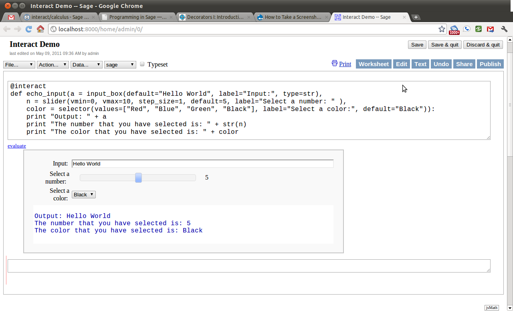
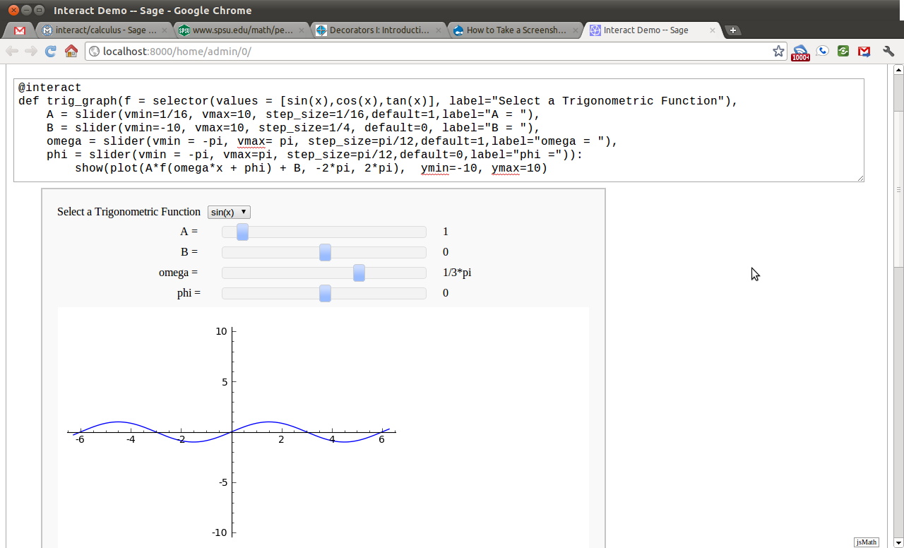

.. _programming_in_sage:

*************************
Programming in Sage
*************************

.. _intro_to_programming:

============
Introduction
============

.. _universes_and_coercion:

Universes and Coercion
----------------------

In order to construct certain objects in Sage, we will need to understand the concepts of Universes (classes) and coercion. The most fundamental universe we work with is :math:`\mathbb{Z}` , the set of integers. Within the integers, we may add, subtract and multiply all we like and we will always get back an integer. However, once we start dividing, we leave the universe of the integers and enter :math:`\mathbb{Q}`, the rational numbers. Yet there are some numbers which cannot be expressed as the ratio of two integers. One such is example is 2.

In Sage, quite appropriately, the integers are given the name ``ZZ``, the rationals ``QQ``,  and the reals ``RR``. ::

	sage: ZZ 
	Integer Ring
	sage: QQ
	Rational Field
	sage: RR
	Real Field with 53 bits of precision
				

In addition to these, we may work with complex numbers :math:`\mathbb{C}` in Sage. The complex numbers, sometimes called imaginary numbers, are numbers of the form :math:`a+bi` where :math:`a` and :math:`b` are real and :math:`i=-1`. As one might expect, the complex numbers are given the name ``CC``. ::

	sage: CC
	Complex Field with 53 bits of precision
				

We can check if certain objects live in a universe using the ``in`` operator. ::

	sage: 1 in ZZ  
	True
	sage: 1/2 in ZZ
	False
	sage: 1/2 in QQ
	True
	sage: sqrt(2) in QQ
	False
	sage: sqrt(2) in RR
	True
	sage: i in RR
	False
	sage: i in CC
	True
				

When working in Sage it is always important to understand which universe we are working in. To check which universe we are in, we use the :func:`.parent` function. ::

	sage: parent(1)
	Integer Ring
	sage: parent(1/2)
	Rational Field
	sage: parent(pi)
	Symbolic Ring
	sage: parent(pi.n())
	Real Field with 53 bits of precision
				

Notice that ``pi`` is naturally contained in the ``Symbolic Ring``. This is why expressions involving pi are evaluated using exact identities as opposed to numerical approximations. However, ``pi.n()`` is the numerical approximation of pi.

Here's an interesting example of what happens when we mix the pi symbol with a decimal. ::

	sage: exp(1.)*pi
	2.71828182845905*pi
	sage: parent(exp(1.)*pi)
	Symbolic Ring
				

Sage will always choose the universe which offers the most precision.

At times, however, we want Sage to think of a certain object as living in a particular universe through a process called coercion. Let's see some examples: ::

	sage: QQ(.5)              
	1/2
	sage: sqrt(2)
	sqrt(2)
	sage: RR(sqrt(2))
	1.41421356237310
				

In general, we coerce an element x into a structure R with the command ``R(x)``. The coercion must make sense, of course.

.. _booleans:

Booleans
-------------

A boolean is a truth value, represented by ``True`` or ``False``. ::

	sage: True        
	True
	sage: False
	False
				

It is important to understand how to work with booleans for programming. The two most fundamental operators for booleans are ``and`` and ``or``. Suppose X and Y are booleans.

      * (X and Y) is True if both X and Y are True.
      * If at least one of them is False, then it is False.
      * (X or Y) is True if at least one of X or Y is True. 

As demonstrated by the following example ::

	sage: True and False
	False
	sage: True and True
	True
	sage: True or False
	True
	sage: False or False
	False

We may use parentheses to control the order of evaluation of these truth statements. ::

	sage: (True or False) and False
	False
	sage: True or (False and False)
	True
				

In the first example (True or False) is evaluated to be True first, then True and False evaluates to be False. In the second example, (False and False) evaluates to be False, but True or False is True.

Another important operator on booleans is the exclusive or operator, represented by ``^^`` in Sage. (``X ^^ Y``) is ``True`` if exactly one of X or Y is ``True``, and the other is ``False``; otherwise it is ``False``. ::

	sage: True ^^ True         # xor (exclusive or) operator
	False
	sage: True ^^ False
	True
	sage: False ^^ False
	False
				

We can also negate a boolean using the not operator. ::

	sage: not True
	False
	sage: not False
	True
				

Equalities are boolean statements which indicate whether two objects are equal. To check equality we use the ``==`` operator. ::

	sage: 1 == 1
	True
	sage: 1 == 0
	False
				

Please take note that we use two equals signs, not one! To check if two things are not equal, we have two options: The ``!=`` operator and the ``<>`` operator. ::

	sage: 1 != 1
	False
	sage: 1 != 0
	True
	sage: 1 <> 0
	True
				

If two objects belong to a universe in which it makes sense to say one is greater than the other, then we also check this in Sage. This is what is meant by an inequality. We use ``>`` for greater-than and ``<`` for less-than; Additionally we use ``>=`` for greater-than-or-equal-to and similarly ``<=`` for less-than-or-equal-to. The following examples may seem silly. In practice, boolean tests are used to test when some varying object satisfies a property of interest. ::

	sage: 1 > 2
	False
	sage: 2 > 1
	True
	sage: 4.1 < 5.7
	True
	sage: 6 < 5
	False
	sage: 1 >= .99999
	True
	sage: 1 <= 35
	True

.. _variables:

Variables
----------

In Sage, a variable is a label which is assigned a value. Here's an example. ::

	sage: m=2^19-1
	sage: m
	524287
				

We use an ``=`` to assign the value on the right to the variable on the left. Having assigned a variable, we can reference by using its name, as seen in the previous example.

In Sage, we may assign new values to the same variable. ::

	sage: s=12
	sage: s
	12
	sage: s=34
	sage: s
	34
				

We may also reference a variable while assigning it a new value. For example, ::

	sage: t=7
	sage: t=t+1
	sage: t
	8
				

Sage also offers us a clever way to assign multiple variables at once. ::

	sage: a,b=1,2
	sage: a
	1
	sage: b
	2
				

Additionally, we can display a sequence of variables using commas. ::

	sage: c,d,e=2,3,5
	sage: c,d,e
	(2, 3, 5)
				

If we are assigning multiple variable at a time, and for some reason we wish to skip a value on the right hand side, we may use an underscore on the left hand side. For example, ::

	sage: a,_,c=1,2,3
	sage: a
	1
	sage: c
	3
	sage: _,r = divmod(19,5)
	sage: r
	4
	sage: 
				
.. _lists_and_strings:

Lists and Strings
------------------

In this section we shall cover the basic properties of lists and some fundamental functions associated with lists. Also included in this section is a bit of info about strings, as they act like lists in Sage.

.. _lists:

Lists
^^^^^^^^^

A list is essentially an ordered collection of objects. The elements of a list are indexed by the integers, starting with 0. We may assign lists to a variable and access their elements through indices (the plural of index) Here is a trivial example. ::

	 sage: [6,28,496,8128]
	 [6, 28, 496, 8128]
	 sage: s=[2,3,5,7,11,13,17,2]
	 sage: s[0]
	 2
	 sage: s[1]
	 3
	 sage: s[5]
	 13
	 sage: s[6]
	 17
					 

Take careful note of how we access the elements: Though 2 is the first element of the list 's', it is accessed by the index 0.

If we wish to know the index of an element, we use the :func:`.index` function. It produces the index for the first occurrence.

We can also count the number of times that an element occurs in a list. ::

         sage: y = [2,3,3,3,2,1,8,6,3]
	 sage: y.index(2) 
	 0
	 sage: y.index(3)
	 1
	 sage: y.index(14)
	 ...
	 ValueError: list.index(x): x not in list
	 sage: w.count(3)
	 4
					 

We can sort the elements of 'y', which changes 'y'. ::

         sage: y = [2,3,3,3,2,1,8,6,3]
	 sage: y.sort(); y
	 [1, 2, 2, 3, 3, 3, 3, 6, 8]
	 sage: y.index(2)
	 1
					 

We may alter the elements of a list as follows: ::

	 sage: u=[1,2,3,4]
	 sage: u[0]=-1
	 sage: u
	 [-1, 2, 3, 4]
					 

To add an element to the end of a list, we use the :func:`append` function. ::

	 sage: q=[1,2,3]
	 sage: q.append(4)
	 sage: q
	 [1, 2, 3, 4]
					 

Similarly, we may use the :func:`extend` function to concatenate two lists, that is, to append a list to the end of a list. ::

	 sage: a=[1,2]
	 sage: a.extend([10,11,12])
	 sage: a
	 [1, 2, 10, 11, 12]

It is, perhaps, simpler to use the ``+`` operator to concatenate lists. Notice that for two lists ``a`` and ``b`` the two sums ``a+b`` and ``b+a`` are usually not equal. ::

	 sage: [1,3,5]+[2,4,6]+[100]
	 [1, 3, 5, 2, 4, 6, 100]
	 sage: [2,4,6]+[1,3,5]+[100]
	 [2, 4, 6, 1, 3, 5, 100]
					 

Lists need not contain only integers, or even numbers. For whatever reason, we can have lists of lists! ::

	 sage: T=[[1,2],[1,3],[1,4]]
	 sage: T[2]
	 [1, 4]
					 

If we wish to remove an element from a list, we use the meth:`.remove` method. ::

	 sage: v=[3,5,11,13,17,19,29,31]
	 sage: v.remove(11)
	 sage: v
	 [3, 5, 13, 17, 19, 29, 31]
					 

Note that a list may contain the same element more than once; ``remove()`` removes only the first instance of the given element. ::

	 sage: w=[1,2,3,0,3,4,4,0,4,5]
	 sage: w.remove(3)
	 sage: w
	 [1, 2, 0, 3, 4, 4, 0, 4, 5]
	 sage: w.remove(4)
	 sage: w
	 [1, 2, 0, 3, 4, 0, 4, 5]

.. seealso::

   `An informal introduction to Python: Lists <http://docs.python.org/tutorial/introduction.html#lists>`_
					 
.. _sets:

Sets
^^^^^^^^^

We may convert a list to a set. This will remove repeated elements. Then to find the number of elements ask for the cardinality. ::

	 sage: y = [2,3,3,3,2,1,8,6,3]
	 sage: sety = Set(y)
	 sage: sety
	 {8, 1, 2, 3, 6}
	 sage: sety.cardinality()
	 5
					 

We can also apply the usual set operations: :meth:`.union`, :meth:`.intersection`, :meth:`.difference` and :meth:`.symmetric_difference`. For example, ::

         sage: sety.union(Set([3,2,2,5]))
	 {1, 2, 3, 5, 6, 8}
	 sage: sety.intersection(Set([3,2,2,5]))
	 {2, 3}
					 

Use the :meth:`.subsets` method to construct the set of all subsets of a set, or to construct the set of subsets with a specified number of elements. ::
         sage: A = Set([1,2,3]); A
	 {1, 2, 3}
	 sage: powA = A.subsets(); powA
	 Subsets of {1, 2, 3}
	 sage: pairsA = A.subsets(2); pairsA
	 Subsets of {1, 2, 3} of size 2
	 sage: powA.list()
	 [{}, {1}, {2}, {3}, {1, 2}, {1, 3}, {2, 3}, {1, 2, 3}]
	 sage: pairsA.list()
	 [{1, 2}, {1, 3}, {2, 3}]					 

.. seealso::
   `Sage Tutorial: sets <http://www.sagemath.org/doc/tutorial/programming.html#sets>`_

.. _strings:

Strings
^^^^^^^^^

To construct a string in Sage we may use single or double quotes. For consistency, we will always use single quotes ::

	 sage: a='I am a string'
	 sage: a
	 'I am a string'
	 sage: print a
	 I am a string
					 

Note the difference between asking for the value of a and asking Sage to print a. Like lists, we can access the elements of a string through their indices ::

	 sage: s='mathematics'
	 sage: s[0]
	 'm'
	 sage: s[4]
	 'e'
					 

Sage offers a convenient way to create lists containing consecutive integers ::

	 sage: [1..7]
	 [1, 2, 3, 4, 5, 6, 7]
	 sage: [4..9]
	 [4, 5, 6, 7, 8, 9]
	 sage: [2,4..10]
	 [2, 4, 6, 8, 10]
					 

In the first two examples it is quite clear what is happening; In the last example above, however, it is a trickier. If we input ``[a,b..c]`` for integers a,b and c with :math:`a < b \leq c`, we get back the list ``[a,a+d,…,a+k*d]`` where :math:`d=b-a` and :math:`k` is the largest integer such that :math:`a+kd \leq c`. If this is a bit overwhelming, perhap some examples will clear things up ::

	 sage: [1,4..13]
	 [1, 4, 7, 10, 13]
	 sage: [1,11..31]
	 [1, 11, 21, 31]
	 sage: [1,11..35]
	 [1, 11, 21, 31]
					 

Additionally, we can use this construction method with some of Sage's symbolic constants such as ``pi`` ::

	 sage: [pi,4*pi..32]
	 [pi, 4*pi, 7*pi, 10*pi]
					 

Having constructed lists, we may now introduce some important functions which take lists as an argument. The most fundamental perhaps is the :func:`.len` function, which returns the number of elements of the list ::

	 sage: len([1..1001])
	 1001
	 sage: len([2,3,5,7,11])
	 5
					 

:func:`.len` will also give us the number of characters in a string ::

	 sage: c='Gauss'
	 sage: len(c)
	 5
					 

Two convenient functions associated with lists are :func:`.sum` and :func:`.prod`.  ``sum`` returns the sum of the elements of a list ::

	 sage: sum([1,2,3])
	 6
	 sage: sum([1..100])
	 5050
					 

``prod`` returns the product of the elements of the list ::

	 sage: prod([1..4])
	 24
					 

One must be careful using ``sum`` and ``prod.`` In particular, the elements of the list must all belong to a universe with a definition of addition and/or multiplication.

Another useful function is :func:`.map`. This function takes a function f and a list ``[a0,…,an-1]`` and returns ``[f(a0),…,f(an-1)]`` ::

	 sage: map(cos,a)
	 [cos(1), cos(2), cos(3), cos(4), cos(5)]
	 sage: map(factorial,a)
	 [1, 2, 6, 24, 120]
	 sage: sum(map(exp,a))
	 e + e^2 + e^3 + e^4 + e^5

.. _external_files_and_sessions:

External Files and Sessions
------------------------------

In practice, especially when using sage for research and projects, it is much more convenient to load external files into Sage. There are many situations in which it is convenient to use an external file. One such instance is when we have a block of code which we wish to run for several different cases. It would be quite tedious to retype all of our code, and thus we can write it to an external file.

Let us move on to an example. Suppose we have a file in the same
directory from which we started Sage called :download:`pythag.sage <pythag.sage>` with the following content.

.. code-block:: python

	# Begin pythag.sage
	a=3
	b=4
	c=sqrt(a^2+b^2)
	print c
	# End
				

Note that all characters after a # of a Sage file are ignored when
loaded. We may now load the file in Sage using the :func:`.load` command. ::

	sage: load pythag.sage
	5
				

After having loaded the file, all of the variables initialized now
exist in our Sage session. ::

	sage: a,b,c
	(3, 4, 5)
				

Along these lines of convenience, Sage allows us to save a session to pick up where we left off. That is, suppose we have done various calculations and have several variables stored. We may call the save_session function to store our session into a file in our working directly (typically sage_session.sobj). Following, we may exit Sage, power off our computer, or what have you. At any later time, we may load the file by opening Sage from the directory containing the save file and using the load_session function.

Here is an example. ::

	sage: a=101
	sage: b=103
	sage: save_session()
	sage: exit
	Exiting SAGE (CPU time 0m0.06s, Wall time 0m31.27s).
				

Now start Sage from the same folder as the save file: ::

	sage: load_session()
	sage: a
	101
	sage: b
	103
				

We may specify the name of a save session, if we so desire. ::

	sage: T=1729
	sage: save_session('ramanujan')
	sage: exit
	Exiting SAGE (CPU time 0m0.06s, Wall time 0m16.57s).
				

And again we load our session ``ramanujan`` with :func:`.load_session`. ::

	sage: load_session('ramanujan')
	sage: T
	1729

.. _intermediate_programming:

=========================
Intermediate Programming
=========================

.. _conditionals: 

Conditionals
----------------

|  You should be familiar with :ref:`variables_equations_inequalities`, :ref:`booleans`, and :ref:`variables` 

A Conditional statement runs a block of code when certain conditions
are met. For example, suppose we wish to halve an integer n if it is
even. Here is how we implement this example in Sage. ::

	sage: n=44
	sage: if n%2 == 0:                             
	....:     print n/2
	....:
	22
	sage: n=37
	sage: if n%2 == 0:                             
	....:     print n/2
	....:
	sage:
				

Notice that since n=44 is even, the condition is met and Sage prints half of n. In the case of n=37, though, the condition is not met and nothing happens.

Unlike some other languages, the syntax used in Sage is picky about indentation. All of the code to be run if a condition is met must have the same level of indentation. This takes some getting used to, but it produces neat, organized code.

At times we may wish to check for different cases. To do so we use the
elif operator, which is short for else if. ::

	sage: m=31
	sage: if m%3==0:
	....:     print m/3
	....: elif m%3==1:
	....:     print (m-1)/3
	....:     
	10
				

Notice that we had to return to the original level of indentation of
the if for the elif. elif must occur after an if, and we may use as
many elifs as we desire. Once one of the conditions is met, the
associated code is executed and Sage leaves the conditoinal
structure. For example, consider the following conditional structure. ::

	sage: r=55
	sage: if 11.divides(r):
	....:     print 11            
	....: elif r==55:
	....:     print 55
	....:     
	11
				

Here both conditions are clearly met, but we only run the code of the first condition met. This is very fundamental to controlling the flow of code. There is also a subtle thing to note in the previous example. ``11.divides(r)`` already returns a boolean, hence we do not need to use an equality here. We could have just as easily used ``11.divides(r)==True`` but it is not necessary.

Often we wish to execute some code if none of our conditions above are
met. For this we use the else operator. ::

	sage: n=2*3*5+1
	sage: if 2.divides(n):
	....:     print 2
	....: elif 3.divides(n):
	....:     print 3
	....: else:
	....:     print n
	....:     
	31
				

Since none of the conditions were met, our code defauled on the else and printed n. 

.. _while_loops:

While loops
--------------------

|  You should be familiar with :ref:`variables` and :ref:`booleans`

While loops are one of the most useful techniques in
programming. Essentially, a while loop runs a block of code while a
condition is still satisfied. Let's see a simple example. ::

	sage: i=0
	sage: while i < 5:
	....:     print i^2
	....:     i=i+1
	....:     
	0
	1
	4
	9
	16
				

Once the condition i<5 is False, Sage exits the loop structure; the variable i still exists, though.

.. _for_loops:

For Loops
-------------------

You should be familiar with :ref:`variables`, :ref:`booleans`, and :ref:`lists`

A for loop repeatedly runs a block of code a fixed number of times. In
Sage, for loops iterate over a fixed list. ::

	sage: for i in [0..4]:
	....:     print i^2
	....:     
	0
	1
	4
	9
	16
				

We may iterate over any list, it need not be consecutive
integers. Here are a few more (especially silly) examples ::

	sage: for str in ["apple","banana","coconut","dates"]:                            
	....:     print str.capitalize()
	....:     
	Apple
	Banana
	Coconut
	Dates
	sage: for char in "Leonhard Euler":   
	....:     print char.swapcase()
	....:     
	l
	E
	O
	N
	H
	A
	R
	D
	
	e
	U
	L
	E
	R

.. loops_in_lists:

Loops in Lists
------------------------------

|  You should be familiar with :ref:`lists` and :ref:`for_loops`

A particularly useful and mathematical technique in Sage is the
construction of a list using 'list comprehensions'. Consider the
mathematically-written set :math:`{2k\ : \ 0 \leq k
\leq10}={0,2,4,…,18,20}`. We can place a ``for`` inside of a list to
construct this object with similar notation ::

	sage: [ 2*k for k in [0..10] ]
	[0, 2, 4, 6, 8, 10, 12, 14, 16, 18, 20]
				

This concept may seem a bit intimidating at first, but it is extremely useful.

Now consider the more specific set :math:`\{2k:0\leq k \leq 10,
\gcd(3,k)=1 \}` which is the set :math:`\{2,4,8,10,14,16,20 \}`. We
can add a conditional statement inside the list to again beautifully
construct this set ::

	sage:  [ 2*k for k in [0..10] if gcd(3,k)==1 ] 
	[2, 4, 8, 10, 14, 16, 20]
				

Notice that the syntax for the construction is nearly identical to the
mathematical notation.

.. seealso::

   `More on list comprehensions <http://docs.python.org/tutorial/datastructures.html#list-comprehensions>`_

.. _functions:

Functions
----------------------

A function in Sage an object containing a block of code which processes a set of arguments and returns some value. Well, that's a bit abstract. Essentially a function in Sage is much like a function in mathematics, but certainly not the exact same. A function might better be called a process or a subroutine.

Anyway, consider the following common mathematical function
:math:`f(x)=x^2`. This function f takes a number x and returns its
square. Here's how we might implement this in Sage ::

	sage: def f(x):
	....:     return x^2
				

def tells Sage we are going to define a function. Following def we supply the name of the function and the arguments it takes in parentheses. Here we named our function f and it takes a single argument x.

The evaluations of functions in Sage mimics the regular mathematical
notation. Let's evaluate our function f from above ::

	sage: f(2)
	4
	sage: f(pi)
	pi^2
				

Certainly these are the results we'd expect.

Functions may have any number of arguments. It is permissible for a
function to have no arguments ::

	sage: def g(x,y):
	....:     return x*y
	....: 
	sage: g(2,3)
	6
	sage: g(sqrt(2),sqrt(2))
	2
	sage: def h():                
	....:     return 1/2
	....: 
	sage: h()
	1/2
				

Here our function g is essentially a multiplication operator. The function h takes no arguments and simply returns the value 1/2.

All functions in Sage return an object. If we do not specify something
to return in our function, then Sage returns the empty object None. ::

	sage: def lazy(x):
	....:     print x^2
	....:     
	sage: lazy(sqrt(3))
	3
	sage: print lazy(sqrt(3))
	3
	None
				

Notice that the function prints 3 no matter what, but returns None.

A function may return multiple values separated by commas ::

	sage: def s(x):
	....:     return x^2,x^3
	....: 
	sage: s(1)
	(1, 1)
	sage: s(2)
	(4, 8)
	sage: a,b=s(3)
	sage: a
	9
	sage: b
	27
				

In Sage functions may reference themselves (very metaphysical). A
function which does this is typically called recursive. The most
common example of a recursive function is the factorial function ::

	sage: def fac(n):
	....:     if n==1:
	....:         return 1
	....:     else:             
	....:         return n*fac(n-1)
	....:     
	sage: fac(3)
	6
	sage: fac(4)
	24
				

For the sake of completeness let's examine exactly what is happening
in this last example when we call ``fac(3)``. For n=3, since ``3≠1``, ``fac()`` decides to return ``3*fac(2)``, hence we must evaluate ``fac(2)``. Since ``2≠1``, ``fac()`` decides to return ``2*fac(1)``. Since 1=1, ``fac(1)`` will automatically return 1. Hence we go back into the ``fac(2)`` process and return ``2*1`` which is then returned to the ``fac(3)`` process to obtain ``3*2*1`` which is of course 6. In general, ``fac(n)`` will evaluate to be the product of the first n positive numbers.

Interactive Demonstrations in the Notebook
^^^^^^^^^^^^^^^^^^^^^^^^^^^^^^^^^^^^^^^^^^

.. index:: 
   single: interact; graphics

What we will be discussion in this section is the creation of interactive "Applets" in the Sage notebook. These are done using the :obj:`@interact` decorator. A decorator is a just a fancy piece of python which allows for you to create new functions out of old in a quick and concise manner. You don't have to fully understand decorators to be able to follow this material but If you are interested you can read a very nice `blog post`_ about decorators by Bruce Eckel of `Thinking in Python`_ Fame.

.. _blog post:  http://www.artima.com/weblogs/viewpost.jsp?thread=240808
.. _Thinking in Python: http://www.mindview.net/Books/TIPython

We will begin with the most simple applet. One that creates a single input box and then displays the results. 

.. image:: pics/interact_step1.png
	:alt: Simple "Hello World" Interact Applet
	:height: 485px
	:width: 800px

Lorem ipsum dolor sit amet, consectetur adipiscing elit. Phasellus vulputate sodales turpis. Nullam mi orci, congue hendrerit pretium eget, ultricies nec magna. Suspendisse fringilla pretium egestas. Praesent vel mauris velit. Nulla dignissim ultrices erat, nec commodo sem faucibus sit amet. Sed ac lectus eget arcu ultrices posuere.  Curabitur in nibh sit amet felis hendrerit suscipit ut sed risus.

.. image:: pics/interact_step2.png
	:alt: Simple "Hello World" Interact Applet
	:height: 485px
	:width: 800px

Quisque vel augue et metus imperdiet pellentesque vel vitae ipsum. Suspendisse porta ornare aliquam. Aenean sem metus, rhoncus quis volutpat viverra, tempor eu mauris. Nulla adipiscing sem nec augue vehicula imperdiet. Vestibulum sed dolor augue. Maecenas eu velit diam, at mollis tellus.

.. image:: pics/interact_step3.png
	:alt: Simple "Hello World" Interact Applet
	:height: 485px
	:width: 800px

Mauris sed odio arcu, id fermentum purus. Cras at diam ullamcorper orci scelerisque suscipit. Sed malesuada tortor ut quam bibendum interdum. 

Curabitur tincidunt consectetur nibh. Nullam pretium molestie nulla non fermentum. Praesent sed turpis eu eros rhoncus tincidunt sed imperdiet ante.

